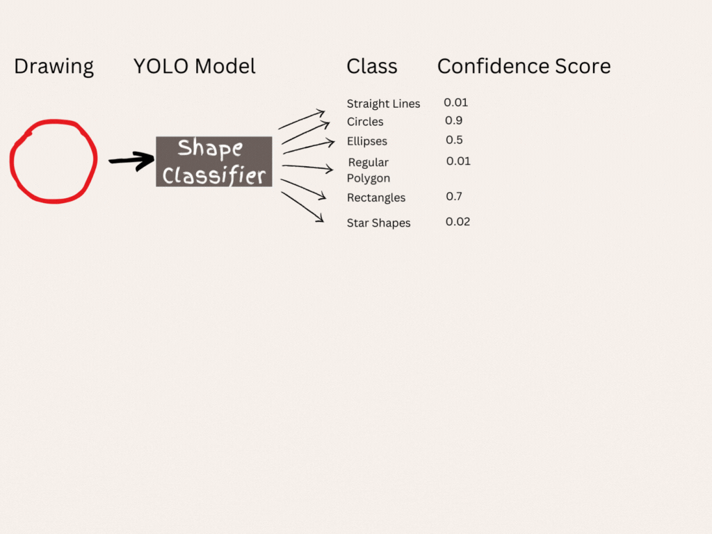
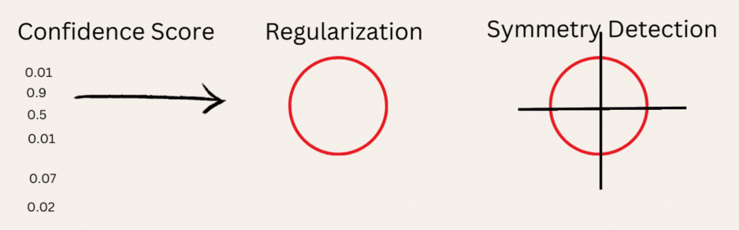

<a name="readme-top"></a>

<!-- PROJECT LOGO -->
<br />
<h1 align="center">CurveCraft: Advanced Framework for Curve Regularization and Symmetry Analysis</h1>
<div align="center">
  <a href="https://github.com/Celebi07/AdobeGenai">
    
  </a>
  <p>
    Welcome to <b>CurveCraft</b>, a project dedicated to refining line art into precise and visually balanced curves. By applying cutting-edge shape detection, mathematical techniques, and curve completion strategies, <b>CurveCraft</b> brings both accuracy and aesthetic appeal to 2D curve analysis and visualization.
  <br />
    <br />
    <a href="https://youtu.be/7Y2kOU450fU">View Demo</a>
    ·
    <a href="https://github.com/Celebi07/AdobeGenai/issues">Report Bug</a>
    ·
    <a href="https://github.com/Celebi07/AdobeGenai/issues">Request Feature</a>
  </p>
</div>


<!-- TABLE OF CONTENTS -->
<details>
  <summary><h2> Table of Contents </h2></summary>
  <ol>
    <li>
      <a href="#abouttheproject"> About The Project </a>
      <ul>
        <li><a href="#mission"> Mission </a></li>
        <li><a href="#valueproposition"> Value Proposition </a></li>
      </ul>
    </li>
    <li><a href="#keyfeatures">Key Features</a></li>
    <li><a href="#builtwith">Built With</a></li>
    <li>
      <a href="#main_pipeline">Main Pipeline</a>
      <ul>
        <li><a href="#detection">Shape Detection</a></li>
        <li><a href="#regularization">Regularization</a></li>
        <li><a href="#symmetry">Symmetry</a></li>
        <li><a href="#completion">Completion</a></li>
      </ul>
    </li>
    <li>
      <a href="#gettingstarted">Getting Started</a>
      <ul>
        <li><a href="#installation">Installation Instructions</a></li>
        <li><a href="#example">Example Usage</a></li>
      </ul>
    </li>
    <li><a href="#license">License</a></li>
    <li><a href="#contributing">Contributing</a></li>
    <li><a href="#team">Team Members</a></li>
  </ol>
</details>

<h2 id="abouttheproject"> About the Project </h2>

Welcome to CurveCraft! Our project is dedicated to identifying, regularizing, beautifying, and completing a variety of curves and shapes in 2D Euclidean space. We aim to enhance and refine these curves, starting with basic forms and advancing to more complex shapes. This initiative is part of the "Adobe GenSolve - Innovate to Impact" Hackathon, in collaboration with GeeksForGeeks.


Watch demo [here](https://youtu.be/7Y2kOU450fU) 

<h3 id="mission"> Mission: </h3>

Our mission is to identify and enhance curves in 2D space. We’ll start by working with closed curves and gradually move on to more intricate shapes. Along the way, we’ll focus on improving the symmetry of curves and completing any incomplete ones.

<h3 id="valueproposition"> Value Proposition: </h3>

1. **Comprehensive Curve Refinement**: Our workflow transforms raw data into well-defined curves by leveraging advanced techniques in shape detection and simplification. This ensures high-quality, accurate representations of complex shapes.

2. **Enhanced Precision with Custom Models**: By incorporating a custom-trained YOLO model, OpenCV, and mathematical equations along with the RDP algorithm, we achieve precise detection and simplification of geometric shapes. This combination ensures that curves and shapes are accurately fitted, leading to smooth and geometrically sound results.

3. **Seamless Integration of Symmetry and Completion**: We enhance curve continuity and visual coherence through advanced symmetry analysis and curve completion techniques, ensuring that even incomplete or irregular curves are finished to perfection.


<p align="right">(<a href="#readme-top">back to top</a>)</p>


<h2 id="keyfeatures"> Key Features </h2>

### Key Features

1. **Flexible Data Handling and Visualization**: Processes data from CSV files to extract polylines, and outputs results in SVG format for clear, scalable visualization, making it adaptable to various input formats and easy to integrate into design tools.

2. **Curve Regularization and Completion**: Regularizes shapes by smoothing boundaries and aligning vertices, while also employing advanced techniques to complete incomplete curves using symmetry information for continuous and geometrically sound results.

3. **Advanced Detection and Simplification**: Combines a custom-trained YOLO model, OpenCV, and the RDP algorithm for precise detection and simplification of geometric shapes, ensuring accurate and smooth curves.

<p align="right">(<a href="#readme-top">back to top</a>)</p>

<h2 id="builtwith"> Built with </h2>
 
     

<h3> Open Source Pre-trained Models: </h3>

- [YOLO](https://github.com/pjreddie/darknet)

<h3> Protocols Used </h3>

- [RDP](https://github.com/FreeRDP/FreeRDP)
- [Scipy](https://github.com/scipy/scipy)

<p align="right">(<a href="#readme-top">back to top</a>)</p>

<h2 id="detection"> Shape Detection </h2>

### CurveCraft employs a comprehensive approach to curve identification and refinement, combining the strengths of YOLO, OpenCV, and mathematical equations. 

### [YOLO](https://github.com/pjreddie/darknet):

- YOLO can detect and identify multiple shapes simultaneously, while traditional CNN models typically handle only one shape at a time.
- It provides precise bounding boxes for each detected shape, allowing for targeted processing of specific areas.
- YOLO’s efficiency in managing complex scenes with various shapes makes it more suitable for our needs compared to standard CNN models.

<br>



<h2 id="regularization"> Regularization </h2>

### [OpenCV and Mathematical Equations](https://github.com/opencv/opencv):

- **Straight Lines and Derived Shapes (Polygons/Rectangles)**:
  - **Ramer–Douglas–Peucker Algorithm**: Simplifies the curve by reducing the number of points while maintaining the shape's integrity.
  - **Curve Approximation**: Ensures that the shape is represented with fewer, yet accurate, points, making it easier to analyze and process.

- **Ellipses**:
  - **Fitting to Ellipse Equation**: Points are fitted into an ellipse equation to achieve an accurate representation of the ellipse.
  - **Bezier Curve Adjustments**: Refines the ellipse using Bezier curves to smooth and adjust the shape as needed.

- **Circles**:
  - **Hough Circle Transform**: Detects the radius and center of the circle, enabling precise regularization.
  - **Circle Regularization**: Uses the detected parameters to standardize and refine the circle's appearance.

- **Star Shapes**:
  - **Contour Analysis**: Focuses on contours with 10 vertices to identify star-shaped patterns.
  - **Contour Plotting and RDP Algorithms**: Applies contour plotting and the RDP algorithm to perfect the star shape and ensure accuracy.
<br>


<br>


<br>

<h2 id="symmetry"> Symmetry </h2>
- Analyze the regularized shapes for symmetry to determine if they exhibit balanced characteristics by checking each shape against potential symmetry lines.

<h2 id="completion"> Curve Completion </h2>
- For shapes identified as asymmetrical, complete them by calculating and extending along the expected symmetry line to ensure a balanced and geometrically precise final shape.

<br>


### Key Advantages:

- **High Precision Detection**: YOLO’s custom-trained model offers accurate identification of fundamental geometric shapes, enhancing the precision of curve detection and simplification.
- **Advanced Refinement**: Leveraging OpenCV and mathematical equations, CurveCraft ensures smooth and geometrically accurate results, improving the overall quality of the processed curves.
- **Flexible and Scalable**: The system's ability to handle diverse data formats and output results in PNG format supports seamless integration into various design and analysis workflows.

<p align="right">(<a href="#readme-top">back to top</a>)</p>

<h2 id="gettingstarted"> Getting Started </h2>

<h3 id="installation"> Installation Instructions: </h3>

To setup CurveCraft in your local macVhine, you need to have the following prerequisites installed on your system:

1. **Python 3.8 or higher:** [Download and install Python](https://www.python.org/downloads/) if you haven't already.


Once you have the prerequisites, you can set up CurveCraft by following these steps:

1. **Clone the repository:**

   ```
   git clone https://github.com/Celebi07/AdobeGenai
   ```

2. **Navigate to the project directory:**
   ```
   cd AdobeGenai
   ```
3. **Install dependencies:**
   ```
   pip install -r requirements.txt
   ```


<h3 id="example"> Example Usage: </h3>

To see CurveCraft in action, check out our demo or refer to the detailed example usage guide in our documentation:

- **Demo:** [Watch the Demo](https://youtu.be/jKpPOpVc6yM)
- **Workflow:** [Checkout the workflow outputs](./docs/workflow.md)

Feel free to explore and experiment with the provided examples to understand how to make the most out of CurveCraft for your projects.

<p align="right">(<a href="#readme-top">back to top</a>)</p>

<h2 id="license"> License </h2>

CurveCraft is licensed under the MIT license. For more information, please see the [LICENSE](LICENSE) file in the repository.

<p align="right">(<a href="#readme-top">back to top</a>)</p>

<h2 id="contributing"> Contributing </h2>

We welcome contributions! For detailed instructions on how to contribute, please refer to the [Contributing Guide](docs/contributing.md) in our documentation.

<p align="right">(<a href="#readme-top">back to top</a>)</p>

<h2 id="team"> Team Members </h2>

- [Kashish Garg](https://github.com/Celebi07)
- [Disha Dwivedi](https://github.com/Dis1309)
- [Samarth Sahu](https://github.com/Samcoding5854)

<p align="right">(<a href="#readme-top">back to top</a>)</p>