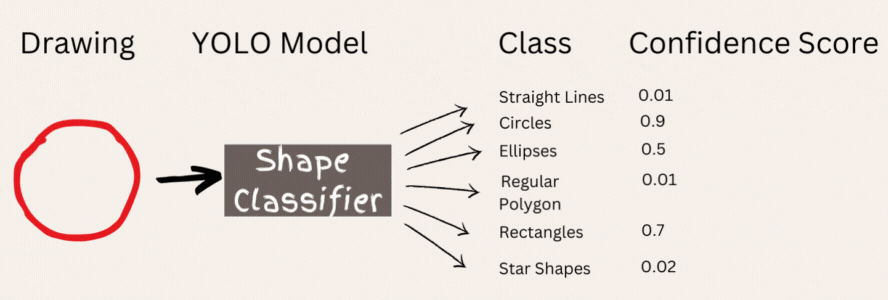
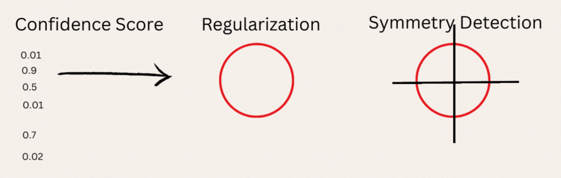
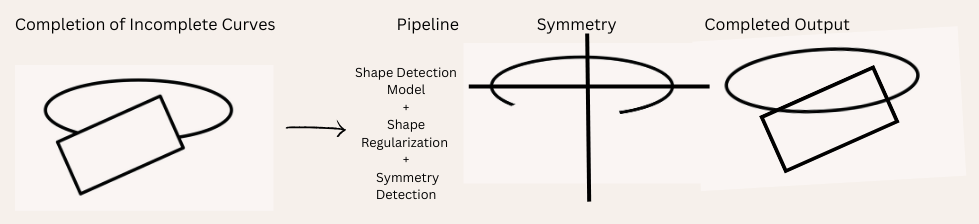

# CurveCraft: A Comprehensive Framework for Advanced Curve Regularization and Symmetry Analysis

Welcome to **CurveCraft**, a cutting-edge project designed to transform line art data into mathematically refined and visually harmonious curves. Leveraging state-of-the-art shape detection algorithms, advanced mathematical techniques, and sophisticated curve completion strategies, **CurveCraft** brings precision and elegance to the analysis and visualization of 2D curves.

## Project Overview

### Objective
The primary objective is to develop an end-to-end pipeline that ingests a CSV file containing polyline representations of line art and outputs a set of connected cubic Bezier curves. These curves are optimized for symmetry, regularization, and completeness.

### Input
- **CSV File**: The input dataset is a CSV file representing the line art as a sequence of 2D coordinates, corresponding to polylines that approximate the original artistic intent.

### Process Workflow
1. **Data Parsing**: The CSV file is parsed to extract and reconstruct paths as polylines in 2D Euclidean space, serving as the basis for subsequent processing.
2. **Geometric Shape Detection**: Using OpenCV and a custom-trained YOLO model, the reconstructed image undergoes a comprehensive shape detection phase to identify fundamental geometric structures.
3. **RDP Simplification**: The Ramer-Douglas-Peucker (RDP) algorithm is applied to each detected shape, effectively reducing the number of vertices while preserving the structural integrity of the polygons and lines.
4. **Shape Regularization**: Detected geometric shapes are subjected to a rigorous regularization process, optimizing their form by smoothing boundaries and aligning vertices according to geometric constraints.
5. **Symmetry Analysis**: The regularized shapes are further analyzed for symmetry, with symmetry axes or central points identified to enhance the visual and mathematical coherence of the output curves.
6. **Curve Completion**: For any incomplete curves detected, a sophisticated curve completion model is employed. This model utilizes the symmetry information to extrapolate and seamlessly complete the curves, ensuring continuity and geometric fidelity.

### Output
- **Curves**: The output consists of a set of mathematically optimized and visually appealing paths, characterized by smooth, continuous cubic Bezier curves.
- **SVG Rendering**: The final curves are rendered in SVG format, allowing for high-fidelity visualization in web browsers and other vector graphic-compatible platforms.

## Technical Approach

### 1. Geometric Shape Detection
A custom-trained **YOLO Model** is employed to accurately detect and classify fundamental geometric shapes such as rectangles, circles, and stars within the reconstructed image.

### 2. Contouring and Mathematical Optimization
Advanced contouring techniques, facilitated by **OpenCV** and **Numpy**, are applied to the detected shapes. These techniques enable precise identification and subsequent regularization of geometric contours.

### 3. Regularization Protocol
A meticulous regularization protocol is implemented to refine the geometric properties of detected shapes. This includes vertex realignment, boundary smoothing, and the enforcement of geometric constraints to achieve idealized shapes.

### 4. Symmetry Detection and Enhancement
Symmetry lines and axes are rigorously computed based on the regularized geometry of the shapes. This analysis enhances the visual and structural symmetry, contributing to the overall aesthetic and mathematical integrity of the curves.

### 5. Advanced Curve Completion
Incomplete curves are identified and completed through an advanced curve completion algorithm. This model leverages the detected symmetry lines to accurately extrapolate and finalize the curves, resulting in seamless, continuous shapes.

## Conclusion
**CurveCraft** represents a sophisticated integration of geometric shape detection, contour regularization, symmetry analysis, and curve completion techniques. The result is a powerful framework capable of transforming raw line art data into highly regularized, symmetrical, and visually harmonious curves, rendered with precision in SVG format.

