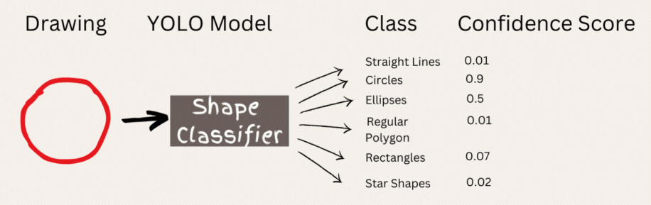

# CurveCraft: Advanced Framework for Curve Regularization and Symmetry Analysis

Welcome to **CurveCraft**, a project dedicated to refining line art into precise and visually balanced curves. By applying cutting-edge shape detection, mathematical techniques, and curve completion strategies, **CurveCraft** brings both accuracy and aesthetic appeal to 2D curve analysis and visualization.

## Project Overview

### Objective
Our goal is to develop a complete pipeline that takes a CSV file of polylines representing line art and transforms it into a set of connected cubic Bezier curves. These curves are optimized for symmetry, regularization, and completeness.

### Input
- **CSV File**: The input is a CSV file that represents line art as a sequence of 2D coordinates, forming polylines that capture the original artistic design.

### Process Workflow
1. **Data Parsing**: The CSV file is parsed to extract paths as polylines in 2D space, forming the foundation for further processing.
2. **Geometric Shape Detection**: Using OpenCV and a custom-trained YOLO model, we detect fundamental geometric shapes in the reconstructed image.
3. **RDP Simplification**: The Ramer-Douglas-Peucker (RDP) algorithm is applied to simplify each shape, reducing vertices while maintaining the essence of the polygons and lines.
4. **Shape Regularization**: Detected shapes are then regularized, smoothing boundaries and aligning vertices to meet geometric standards.
5. **Symmetry Analysis**: We analyze the regularized shapes for symmetry, identifying symmetry axes or central points to enhance the coherence of the output curves.
6. **Curve Completion**: For incomplete curves, our curve completion model uses symmetry information to seamlessly finish the curves, ensuring they are continuous and geometrically accurate.

### Output
- **Curves**: The output is a set of mathematically refined and visually appealing cubic Bezier curves.
- **SVG Rendering**: These curves are rendered in SVG format for high-quality visualization on web browsers and other vector graphic platforms.

## Technical Approach

### 1. Geometric Shape Detection
We use a custom-trained **YOLO Model** to detect and classify fundamental geometric shapes like rectangles, circles, and stars in the image.

### 2. Contouring and Mathematical Optimization
Advanced contouring techniques in **OpenCV** and **Numpy** are used to identify and regularize geometric contours with precision.

### 3. Regularization Protocol
Our regularization process refines the shapes by realigning vertices, smoothing boundaries, and enforcing geometric constraints, resulting in idealized forms.

### 4. Symmetry Detection and Enhancement
We compute symmetry lines and axes based on the regularized shapes, improving both visual and structural symmetry.

### 5. Advanced Curve Completion
We identify and complete incomplete curves using a sophisticated algorithm that leverages symmetry lines to accurately extrapolate and finalize the curves.

## Conclusion
**CurveCraft** integrates geometric shape detection, contour regularization, symmetry analysis, and curve completion techniques into a powerful framework. The result is the transformation of raw line art into regularized, symmetrical, and visually appealing curves, rendered precisely in SVG format.
