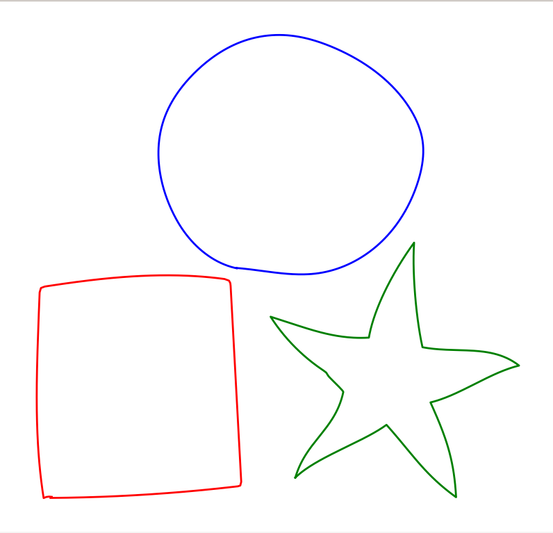
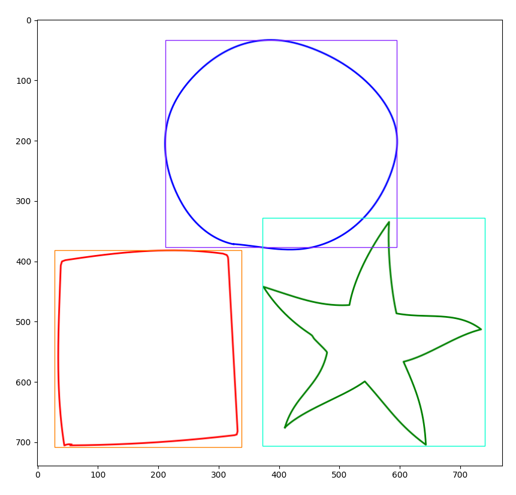
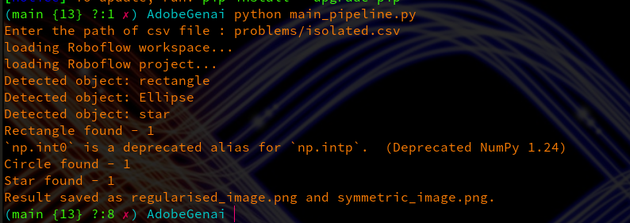
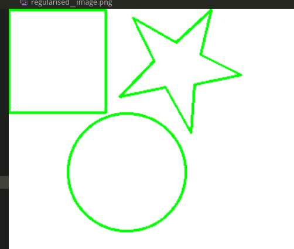
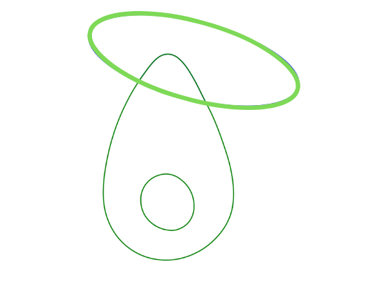

<a name="readme-top"></a>

# Setup Guide for CurveCraft

This guide will help you set up the development environment for `CurveCraft` using Python and Poetry.

## Prerequisites

Before getting started, ensure you have the following prerequisites installed:

1. **Python 3.8 or higher**: If you haven't installed Python yet, you can download the latest version from the [official Python website](https://www.python.org/downloads/). Follow the installation instructions for your operating system.

   #### Steps for Installing Python

   - **Windows**: Download the installer from the Python website and follow the installation wizard.
   - **macOS**: Python usually comes pre-installed. You may need to update it using Homebrew or install it manually.
   - **Linux**: Use your package manager to install Python. For example, on Ubuntu, you can use `apt`:
     ```bash
     sudo apt update
     sudo apt install python3
     ```

## Setting Up the Development Environment

1. **Clone the Repository**: First, clone the `AdobeGenai` repository to your local machine using Git:

   ```bash
   git clone https://github.com/Celebi07/AdobeGenai
   ```

2. **Change Directory**: Navigate to the `AdobeGenai` directory:

   ```bash
    cd AdobeGenai
   ```

3. **Install Dependencies**: Use Requirements.txt to install the project dependencies:

   ```bash
     pip install -r requirements.txt
   ```

4. **Start Detecting**: Run main_pipeline.py to start the project:

   ```bash
     python main_pipeline.py
   ```

5. **Start Developing**: You're all set! You can now start developing `CurveCraft` on your local machine.

### Workflow

1. **Enter the Name of the CSV File**: Begin by providing the path to the CSV file that contains the curve data.
   

2. **Shape Identification**: The system analyzes the image and identifies different shapes present within it, laying the groundwork for further processing.
   

3. **Shape Detection Overview**: The terminal displays the names and counts of the shapes detected in the image, giving a summary of the results.
   

4. **Regularized Image**: The identified shapes are then regularized, regularizing out their boundaries and aligning them according to geometric standards.
   

5. **Symmetry Analysis**: The regularized shapes are analyzed for symmetry, highlighting symmetry axes or central points for further refinement.
   

6. **Curve Completion**: Any incomplete curves are seamlessly completed, ensuring they are continuous and geometrically accurate.
   


## Next Steps

- **Get Help**: If you have any questions or need help, feel free to open an issue on the [GitHub repository](https://github.com/Celebi07/AdobeGenai/issues)
